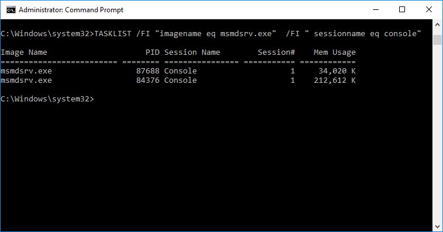
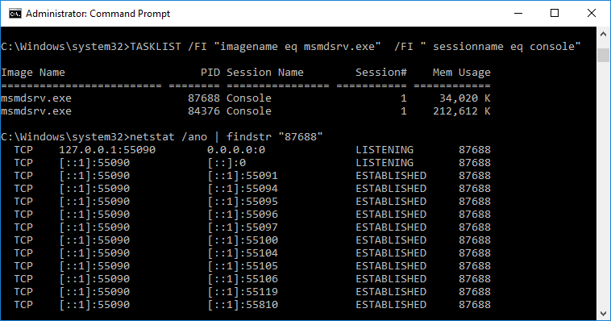
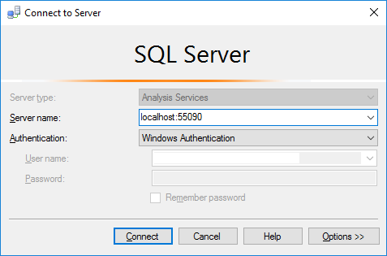
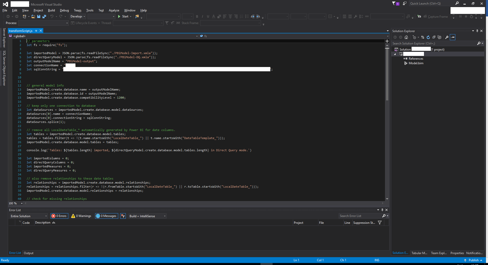
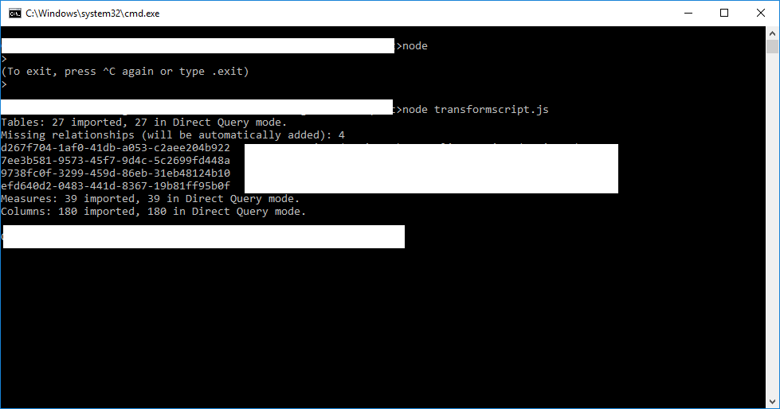
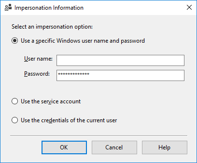
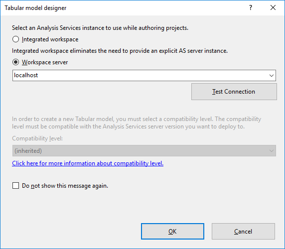
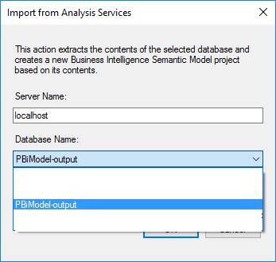
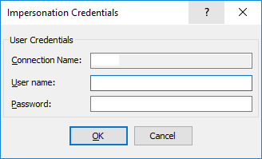
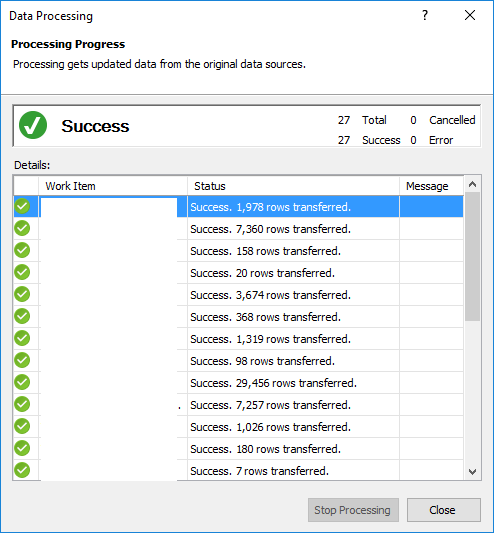

# IMPORT POWER BI DESKTOP MODEL INTO SSAS TABULAR 2016 #

## Abstract ##

[Microsoft Power BI](https://powerbi.microsoft.com) is a suite of business analytics tools that can quickly deliver insights throughout any organization. Since its introduction in late 2013 it has attracted many users with its powerful, yet simple to use interface which allows for connection to multiple data sources, drag-and-drop report building and stunning visuals, as well as easy sharing throughout the business.

As your usage of Power BI matures however, and you consume more and more data with Power BI, data which is then transformed and funneled into dashboards and reports destined for more and more users, you may feel better served to leave the model storage,  access and security to server-side enterprise engines like [Microsoft SQL Server Analysis Services](https://docs.microsoft.com/en-us/sql/analysis-services/analysis-services) (SSAS) Tabular models, or to its cloud-based cousin, [Azure Analysis Services](https://azure.microsoft.com/en-us/services/analysis-services/). 

You can then scale out the model to multiple servers by using these server-side / cloud solutions, and use Power BI to [connect live](https://powerbi.microsoft.com/en-us/documentation/powerbi-sql-server-analysis-services-tabular-data/) and display your stunning dashboards and reports to users with minimum latency and maximum efficiency. 

However, by time you get to the above requirement, you may have tens or hundreds of reports - and underlying data models - already built in Power BI Desktop. It would be great to have an automated way of importing the data models from Power BI into SSAS / AAS, so you don't have to start rebuilding them from scratch. This is a requirement that many people have - [the idea currently has 300+ votes](https://ideas.powerbi.com/forums/265200-power-bi-ideas/suggestions/10882251-import-powerbi-desktop-model-into-ssas-analysis-se) on ideas.powerbi.com, and to date there is no official tooling from Microsoft to enable it.

As such, we have built a small script to assist in automating this process, starting from a PowerBi model (connected to SQL Server with Direct Query) and obtaining the equivalent SSAS 2016 Tabular model. A basic description of the approach is described in [this blog post](http://biinsight.com/import-power-bi-desktop-model-ssas-tabular-2016/).

## Requirements ##


-   SQL Server 2016 Analysis Services (Tabular): You can download SQL Server 2016 Developer Edition for free. [Check this out](http://biinsight.com/how-to-download-sql-server-2016-developer-edition-for-free/)  for more information.

-   SQL Server Management Studio (SSMS) 2016: Down SSMS 2016 from [here](https://msdn.microsoft.com/en-us/library/mt238290.aspx)

-   SQL Server Data Tools for Visual Studio 2015 (SSDT 2015): You can download it [here](https://msdn.microsoft.com/en-us/mt186501.aspx)

-   Power BI Desktop: Download Power BI Desktop from [here](https://powerbi.microsoft.com/en-us/desktop/?gated=0&number=1)

-   Node.js from [here](https://nodejs.org/en/download/)

-   The `source/transformScript.js` javascript file from the current repository. It contains the script to transform the model from PowerBI to SSAS.

## The process

The basic idea, outlined in [this blog post](http://biinsight.com/import-power-bi-desktop-model-ssas-tabular-2016/), is to:

- Connect to Power BI Desktop model from SSMS 2016

- Script the model
- Modify the script

- Execute the scripts on your on-premises instance of SSAS Tabular 2016

- Open the new SSAS Tabular database in SSDT 2016

- Redeploy and process the model

> NOTE: It is assumed that you’re familiar with all the products mentioned above.

## Steps

1.  Have the instance of your PBI report opened both in Direct Query and
    in Import Mode

2.  The next step is to script the models of this report in both direct
    query and Import Mode in SSAS Tabular using SSMS 2016

    -  Run Windows Command Prompt as Administrator

    -  Copy, Paste and Run the following Command that will display the Power BI Desktop 
        PID

```TASKLIST /FI "imagename eq msmdsrv.exe" /FI "sessionname eq console"```



   3. Now run the following command and put the PID number you got from
     previous command between quotation marks. The results should be
     something like the screenshot below which shows active
     connections, their local address which is local IP address
     followed by the port number. And this is what we are looking for.
     Do this for both PIDs belonging to both versions of your report.

```netstat /ano | findstr "87688"```



4.  Open SSMS and connect to Analysis Services for Server Type. Enter
    the server name as “localhost:55090", where 55090 is the port number
    and click connect. Do this for both ports.

 

5.  Export to file the script under every database.

 Right click the database -&gt; Script -&gt; Script Database as -&gt;
 Create to-&gt; File

 > **Important**: Do NOT choose Create to-&gt; New Query Window because the
 resulting script will be altered by the SSMS query editor.

6.  The resulting .xmla files are to be used in a script called
    transformScript.js that will make sure no information is lost
    between direct query and import mode and, also, makes some other
    small changes necessary for the .xmla that you shall be using to
    create the SSAS model. All the lines are explained within the
    script, if you require further information.


7.  In Visual Studio, Open-&gt; File-&gt; `transformScript.js` (you'll find it inside the [`source` folder](source/) of this repository) and change
    the two file names under line 4 and 5 with the ones that you have
    used for the two .xmla files you had previously used and save it.

8.  The connection string defined at line 8 will have the information of
    the location of your data used in building your PBI report.

    The list with all the parameters is
    [here](https://docs.microsoft.com/en-us/sql/relational-databases/native-client/applications/using-connection-string-keywords-with-sql-server-native-client)

    For several data locations, you can check the syntax of the
    connection string
    [here](http://www.sqlteam.com/article/sql-server-connection-string)

9.  Make sure the .xmla files are on the same folder where the javascript is

10.  Run Windows Command Prompt as Administrator



11.  Insert the following command that would be running the script

```node transformscript.js```



12.  The output of this script will be another .xmla, called
    `PBiModel-output.xmla`, the name specified in the javascript in line
    74


13.  Make sure you’re under a `localhost` instance of Analysis Services,
    open and execute the above `PBiModeloutput.xmla`

14.  This will generate a database with the name specified in the script
    at line 6.

15.  The database has connection, tables and roles imported. Go to your
    connections properties and set Impersonation mode:

     

16.  Process this database: right click on the database-&gt; Process
    Database -&gt;Mode-&gt; Process Full

17.  Go to Visual Studio-&gt;New-&gt;Project-&gt;Templates-&gt;Business
    Intelligence-&gt; Import from Server-&gt; and then click OK

18.  The below screen will appear, click OK
    

19.  You will be prompted to select the database. Choose the one we had
    just created



20.  Go to Model-&gt;Process-&gt;Process All. You will be prompted to
    insert your credentials once more. Insert your password

 

 A data processing progress GUI will appear on your screen. It should
 all be successful. Click on Close.

 

 The data should start populating in your tables

21.  Deploy your model in solution explorer by right clicking the project
    and clicking on Deploy.

**And you're done!** You have successfully imported your Power BI model into SSAS.


